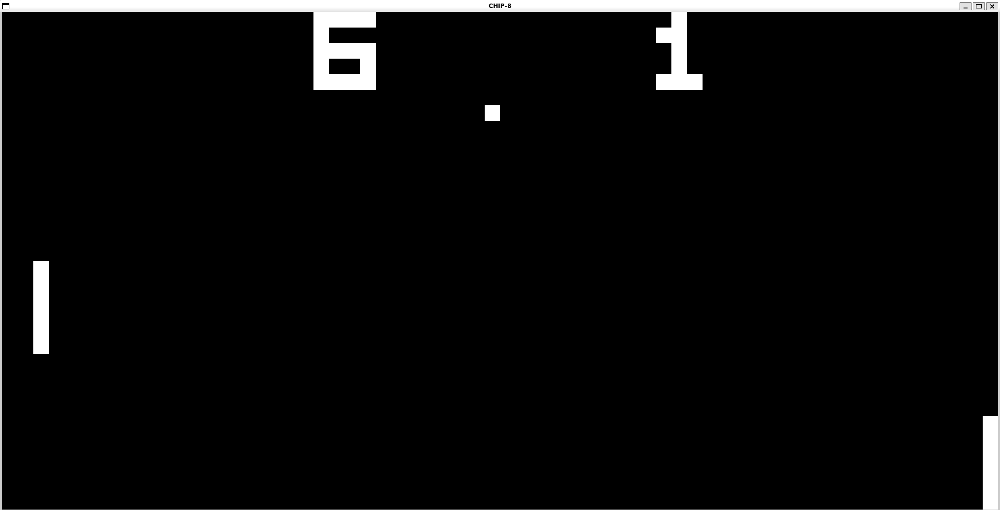

# CHIP-8 Emulator

CHIP-8 emulator in C++ and rendered using SDL.

## TODO

- [ ] Fix sound handling
- [ ] Add command-line configuration options
- [ ] Improve timing implementation

## Credits

- [Tests](https://github.com/Timendus/chip8-test-suite)